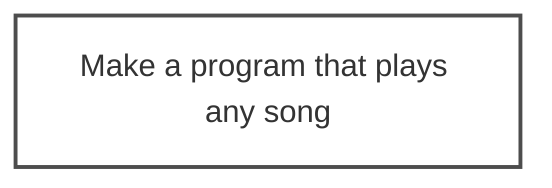

# EDD - Ent Driven Development

## Example

Imagine you are trying to solve for the following problem **"Make a program that plays any song"**.

 

Let's start with a graph that contains this ent and assume the diagram has the following key:
* White Box - Unsolved
* Grey Box - Unsolved and couldn't use AI to solve
* Green Box - Solved by an AI
* Light Green Box - Solved by a Human

## Predictions and FAQ (QAP)
* Q: is Question
* A: is Answer
* P: is Predicion

 

#### Q: What is EDD?
A: EDD is Ent Driven Development.

 

#### Q: What is Ent?
A: Ent is a new word based on the word "Entity". Ent represents the composable blocks of value that can be delivered by user and/or AI.

 

#### Q: Why not just use the word entity?

A: Ent is shorter to say, and I didn't want to cause confusion by using the word entity, which has multiple definitions today.

 

#### Q: Why did you create EDD?

A: To establish a reusable way of making cool stuff in a post AI assistant world.

 

#### Q: What "AI assistants" do you mean here?

A: Referring to a world post ChatGPT and GitHub CoPilot

P: I believe there are going to be different names for the AI assistants in the future. For this reason, I wanted to keep "AI Assistant" fix.
