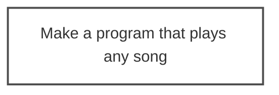
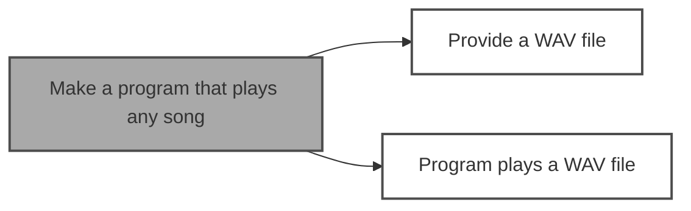
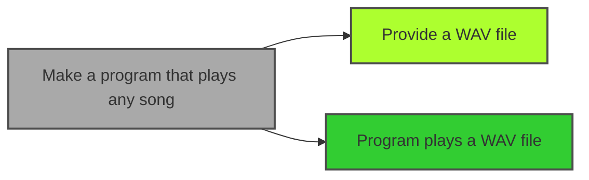
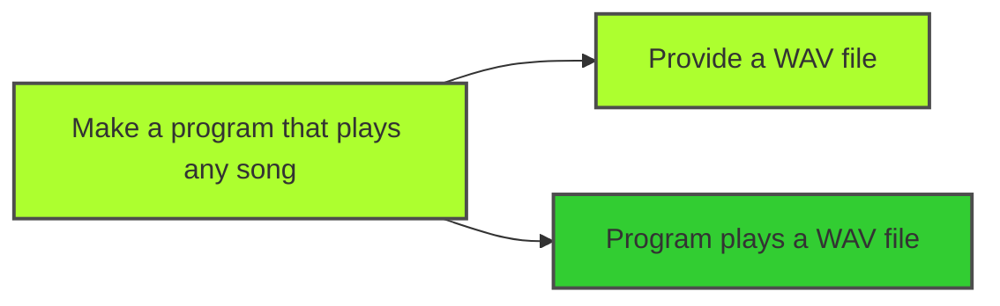
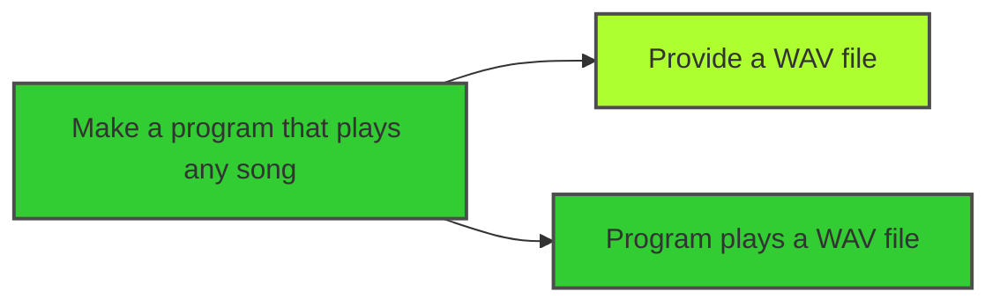

# EDD - Ent Driven Development

## Example 1 (Play any song)

Imagine you are trying to solve for the following problem **"Make a program that plays any song"**.

 

Let's start with a diagram that contains an ent, and assume the following:
* White Box - Unsolved
* Grey Box - Unsolved, couldn't solve with AI
* Green Box - Solved with AI
* Light Green Box - (Mostly) Solved by a Human

Let's say when you try to solve the problem with AI, the program plays only simple songs. It does not play complex songs. You would color the box grey, as this problem was not solved with AI.

To get to the point where you can solve this problem, you can "break down" this ent (Note: You can either break down the ent by yourself or with AI assistance).

Let's say you got to the point where you created the followings ents "Provide a WAV file" and "Program plays a WAV file". Let's add these ents to the diagram.  

Let's say you decide to solve "Provide a WAV file" without AI assistance, you would color this box light-green (as shown in the key above).

Let's say you try to make a "Program that plays a WAV file" with AI assistance, and it works! Let's color this box green (as shown in the key above).

Now you have solved these ents, let's try to solve the original ent. Let's say you simply put the two solutions together, and you confirm the problem is solved! You can also update the diagram.

Note: In another scenario, you could have put the two solutions together with AI assistance to solve the problem, and you confirm it works! It would make this diagram.

## Predictions and FAQ (QAP)
* Q: is Question
* A: is Answer
* P: is Predicion

 

#### Q: What is EDD?
A: EDD is Ent Driven Development.

 

#### Q: What is Ent?
A: Ent is a new word based on the word "Entity". Ent represents the composable blocks of value that can be delivered either with/without AI assistance.

 

#### Q: Why not just use the word entity?

A: Ent is shorter to say, and I didn't want to cause confusion by using the word entity, which has multiple definitions today.

 

#### Q: Why did you create EDD?

A: To establish a reusable way of making cool stuff in a post AI assistant world.

 

#### Q: What "AI assistants" do you mean here?

A: Referring to a world post ChatGPT and GitHub CoPilot

P: I believe there are going to be different names for the AI assistants in the future. For this reason, I wanted to keep "AI Assistant" generic.

 

#### Q: Does EDD replace microservices or bounded contexts?

A: EDD can work with microservice and bounded contexts. Similar to how TDD and BDD works with these concepts.

P: EDD is going to change how people think about microservice and bounded contexts, especially with how focused EDD is on composables pieces of value delivery

 

#### Q: Does EDD replace TDD or BDD?

A: EDD is another option, it doesn't replace TDD or BDD directly (Reminder: EDD is a new way of solving problems in a post AI assistant world).

P: EDD starts with a summarization of the answer, so you will see pros/cons compared to BDD or TDD. In any case, EDD creates new advancements, when taking the best approach to solve a problem
