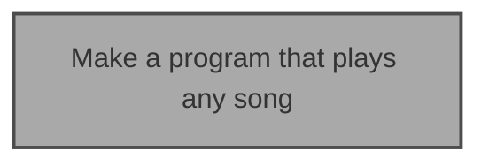

# EDD - Ent Driven Development

## Example 1 (Play any song)

Imagine you are trying to solve for the following problem **"Make a program that plays any song"**.

 

Let's start with a graph that contains an ent, and assume the diagram has the following key:
* White Box - Unsolved
* Grey Box - Unsolved, couldn't solve with AI
* Green Box - Solved with AI
* Light Green Box - (Mostly) Solved by a Human

Let's say when you try to solve the problem with AI, the program plays only simple songs. It does not play complex songs. In this case, you would color the box grey, as this problem was not solved.

To get to the point where you can solve this problem, you can break down this ent (Note: You can either break down the ent by yourself or with AI assistance)

Let's say you got to the point where you created the followings ents "Provide a WAV file" and "Program plays a WAV file". The ent graph now looks like the following:  

Let's say you decide to provide the WAV files yourself, you would color this box light-green (as shown in the key above).

Let's say you try to make a program that plays a WAV file with AI assistance, and it works! Let's color this box green (as shown in the key above).

## Predictions and FAQ (QAP)
* Q: is Question
* A: is Answer
* P: is Predicion

 

#### Q: What is EDD?
A: EDD is Ent Driven Development.

 

#### Q: What is Ent?
A: Ent is a new word based on the word "Entity". Ent represents the composable blocks of value that can be delivered either with/without AI assistance.

 

#### Q: Why not just use the word entity?

A: Ent is shorter to say, and I didn't want to cause confusion by using the word entity, which has multiple definitions today.

 

#### Q: Why did you create EDD?

A: To establish a reusable way of making cool stuff in a post AI assistant world.

 

#### Q: What "AI assistants" do you mean here?

A: Referring to a world post ChatGPT and GitHub CoPilot

P: I believe there are going to be different names for the AI assistants in the future. For this reason, I wanted to keep "AI Assistant" fix.
