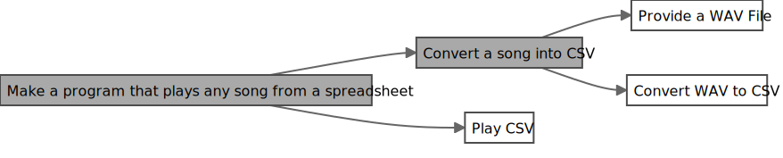
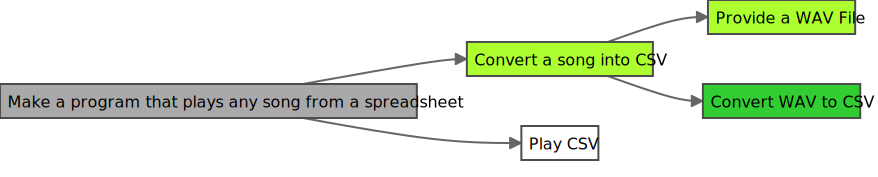
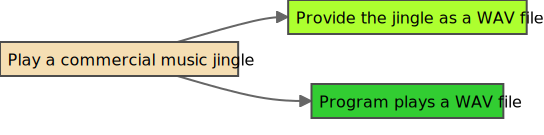

# EDD - Ent Driven Development

EDD is a problem solving process using ChatGPT (and any other future AI assistant). The 'E' in EDD stands for "ent", the core topic used in this process.

More clarifications can be seen in the following examples and FAQ.

## Table of Contents

* [Example 1 - Play any song](#example-1-play-any-song)
* [Example 2 - Play any spreadsheet](#example-2-play-any-spreadsheet)
* [FAQ](#predictions-and-faq-qap)

## Example 1 (Play any song)

Imagine you are trying to solve the following problem **"Make a program that plays any song"**.

 

Let's start with a diagram that contains an ent, and assume the following:
* White Box - Unsolved
* Grey Box - Unsolved, couldn't solve with AI
* Green Box - Solved with AI
* Light Green Box - (Mostly) Solved by a Human

Let's say when you try to solve the problem with AI, the program plays only simple songs. It does not play complex songs. You would color the box grey, as this problem was not solved with AI.

To get to the point where you can solve this problem, you can "break down" this ent (Note: You can either break down the ent by yourself or with AI assistance).

Let's say you got to the point where you created the followings ents "Provide a WAV file" and "Program plays a WAV file". Let's add these ents to the diagram.  

Let's say you decide to solve "Provide a WAV file" without AI assistance, you would color this box light-green (as shown in the key above).

Let's say you try to make a "Program that plays a WAV file" with AI assistance, and it works! Let's color this box green (as shown in the key above).

Now you have solved these ents, let's try to solve the original ent. Let's say you simply put the two solutions together, and you confirm the problem is solved! You can also update the diagram.

Note: In another scenario, you could have put the two solutions together with AI assistance to solve the problem, and you confirm it works! It would make this diagram.

Example 1 is now solved!

## Example 2 (Play any spreadsheet)

Let's use a harder and more innovative example. This example is based on a real life problem and solution! 

Imagine you want to play a CSV file (spreadsheet file), where that CSV contains a representation of a song. Let's create the following ent.

Let's say you try to solve this problem directly with an AI, and it doesn't work. Furthermore, you have no idea how you can even represent a music file using CSV. 

Let's break down this ent into two ents "Convert a song into CSV" and "Play CSV".

Let's say you want to solve "Convert a song into CSV" first. You try to solve this problem with AI assistance, but you have no solution here. You come up with the following ents "Provide a WAV file" and "Convert WAV to CSV".

Similar to Example 1, you provide the CSV file manually. Also, you have performed some excellent prompting, your AI assistant was able to solve the problem of converting a WAV to CSV. Here is the updated EDD diagram.

With these two solutions, you now solve "Convert a song into CSV".

Let's solve "Play CSV" next. You try to solve this problem with AI assistance, but you have no solution here. You come up with the following ents "Convert CSV to WAV" and "Play WAV".

Let's say you try solve "Convert CSV to WAV" and "Play WAV" with AI assistance, and it works! Awesome, these probably worked because of the AI knowing about our prior problems and solutions! Here is the updated diagram.

Let's say you try to solve "Play CSV" with AI assistance again. Although you could have done this manually, now with the prior solution context, the AI assistance solves the problem quickly! Here is where the diagram is now.

We can now solve the original ent, which looks like the following.

Additionally, now that we have more understanding based on our EDD Diagram, we can also update the diagram to be the following.

Example 2 is now solved!

## Predictions and FAQ (QAP)
* Q: is Question
* A: is Answer
* P: is Predicion

Questions:
* [What is EDD?](#q-what-is-edd)
* [What is Ent?](#q-what-is-ent)
* [Why not just use the word entity?](#q-why-not-just-use-the-word-entity)
* [Why did you create EDD?](#q-why-did-you-create-edd)
* [What "AI assistants" do you mean here?](#q-what-ai-assistants-do-you-mean-here)
* [Why are EDD diagrams oriented the way they are?](#q-why-are-edd-diagrams-oriented-the-way-they-are)
* [Why now? Surely someone would have created this before?](#q-why-now-surely-someone-would-have-created-this-before)
* [But it seems like EDD is what I was just doing in my head before? Aren't people already doing this process today? How is this innovative?](#q-but-it-seems-like-edd-is-what-i-was-just-doing-in-my-head-before-arent-people-already-doing-this-process-today-how-is-this-innovative)
* [Where does refactoring and unit testing fit within EDD?](#q-where-does-refactoring-and-unit-testing-fit-within-edd)
* [Is there a way that I can indicate that an ent should be solved without using AI assistance?](#q-is-there-a-way-that-i-can-indicate-that-an-ent-should-be-solved-without-using-ai-assistance)
* [Also, is there a way I can indicate that solved ents shouldn't have been solved using AI assistance?](#q-also-is-there-a-way-i-can-indicate-that-solved-ents-shouldnt-have-been-solved-using-ai-assistance)
* [Can I make a bunch of unsolved ents ahead of time, before I start solving my problem?](#q-can-i-make-a-bunch-of-unsolved-ents-ahead-of-time-before-i-start-solving-my-problem)
* [If there is an API or library that solves one of my ents, can I consider it automatically solved?](#q-if-there-is-an-api-or-library-that-solves-one-of-my-ents-can-i-consider-it-automatically-solved)
* [Does EDD replace microservices or bounded contexts?](#q-does-edd-replace-microservices-or-bounded-contexts)
* [Does EDD replace TDD or BDD?](#q-does-edd-replace-tdd-or-bdd)
* [What color codes did you use for the EDD diagrams?](#q-what-color-codes-did-you-use-for-the-edd-diagrams)

 

#### Q: What is EDD?
A: EDD is Ent Driven Development.

 

#### Q: What is Ent?
A: Ent is a new word based on the word "Entity". Ent represents the composable blocks of value that can be delivered either with/without AI assistance.

 

#### Q: Why not just use the word entity?

A: Ent is shorter to say, and I didn't want to cause confusion by using the word entity, which has multiple definitions today.

 

#### Q: Why did you create EDD?

A: To establish a reusable way of making cool stuff in a post AI assistant world.

 

#### Q: What "AI assistants" do you mean here?

A: Referring to ChatGPT and GitHub CoPilot, and includes any other AI assistants that help solve problems.

P: I believe there are going to be different names for the AI assistants in the future. For this reason, I wanted to keep "AI Assistant" generic.

 

#### Q: Why are EDD diagrams oriented the way they are?

A: EDD reuses the "shift left" philosophy. In this case, EDD puts "solutions that are high impact to you on the left", while "solutions that help you towards your goal solutions" on the right. In this case, you would see and aim to solve the problems farthest left first. Important: This philosphy is used to keep you focused, but it is completely possible that a solution on the right side can provide a ton of value by itself (Example: You intend to solve a problem, but as a byproduct you discover a million/billion dollar solution along the way).

 

#### Q: Why now? Surely someone would have created this before?

A: The key difference is that AI assistants can now help solve problems quickly, offsetting the costs of creating EDD diagrams and making ents. Although there wasn't a need before, going forward the identification of ents will not only solve problems quicker, but also help drive future improvement through identifying problems solved with/without AI.

 

#### Q: But it seems like EDD is what I was just doing in my head before? Aren't people already doing this process today? How is this innovative?

A: Although EDD can work without the usage of AI assistance, the creation of EDD diagrams not only helps you solve problems, it introduces a brand new way of identifying where AI needs to be improved to help you solve problems. Additionally EDD being a consistent, standard, and shareable process provides value.

 

#### Q: Where does refactoring and unit testing fit within EDD?

A: Refactoring and unit testing, are just additional ents that you create. Here is an EDD diagram example:

 

#### Q: Is there a way that I can indicate that an ent should be solved without using AI assistance?

A: Suggestion - You could color the unsolved ent as beige. Here is an example:

 

#### Q: Also, is there a way I can indicate that solved ents shouldn't have been solved using AI assistance?

A: Suggestion - You could also change the border color to beige, and underline the text for both unsolved/solved ents.

 

#### Q: Can I make a bunch of unsolved ents ahead of time, before I start solving my problem?

A: I would recommend attempting to solve the problem first, so that you stay focused on the "[solutions that are high impact to you](#q-why-are-edd-diagrams-oriented-the-way-they-are)".

P: People will make a bunch of unsolved ents ahead of time, due to the flexibility of the EDD process and making diagrams. Although there are definitely cons, there could be pros as well, for your case! My second recommendation here is to first think through the pros/cons, if you do end up taking this approach. 

 

#### Q: If there is an API or library that solves one of my ents, can I consider it automatically solved?

A: No. You should prove your solution succesfully solves the problem, and gets the correct output. There could be a mismatch with the data you have, and the API or library you are interacting with, which is why the ent can't be considered automatically solved.

 

#### Q: Does EDD replace microservices or bounded contexts?

A: EDD can work with microservice and bounded contexts. Similar to how TDD and BDD works with these concepts.

P: EDD is going to change how people think about microservice and bounded contexts, especially with how focused EDD is on composables pieces of value delivery.

 

#### Q: Does EDD replace TDD or BDD?

A: EDD is another option, it doesn't replace TDD or BDD directly (Reminder: EDD is a new way of solving problems in a post AI assistant world).

P: EDD starts with a summarization of the answer, so you will see pros/cons compared to BDD or TDD. In any case, EDD creates new advancements, when taking the best approach to solve a problem.

 

#### Q: What color codes did you use for the EDD diagrams?

A: Here is the list of color codes:

* Black (Default border color)- `#4d4d4d`
* White (Unsolved)- `#fff`
* Grey (Unsolved, couldn't solve with AI) - `#A9A9A9`
* Dark Green (Solved with AI) - `#32CD32`
* Light Green (Mostly solved by a Human) - `#ADFF2F` 
* Beige (Suggestion: Only Human should solve) - `#F5DEB3`
