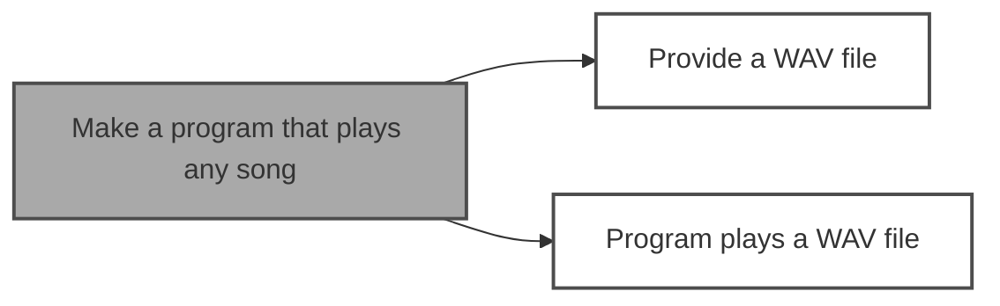

```mermaid
graph LR
    style A fill:#A9A9A9,stroke:#4d4d4d,stroke-width:2px,rounded:10px
    style B fill:#fff,stroke:#4d4d4d,stroke-width:2px,rounded:10px
    style C fill:#fff,stroke:#4d4d4d,stroke-width:2px,rounded:10px
    A[Make a program that plays any song]
    B[Provide a WAV file]
    C[Program plays a WAV file]
    A --> B
    A --> C
```