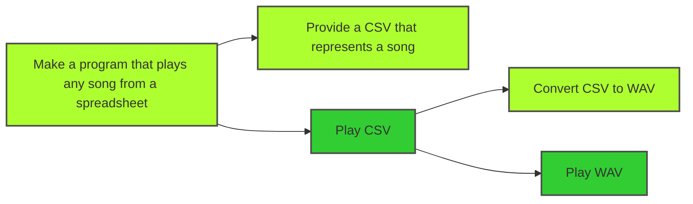

```mermaid
graph LR
    style A fill:#ADFF2F,stroke:#4d4d4d,stroke-width:2px,rounded:10px
    style B fill:#ADFF2F,stroke:#4d4d4d,stroke-width:2px,rounded:10px
    style C fill:#32CD32,stroke:#4d4d4d,stroke-width:2px,rounded:10px
    style D fill:#ADFF2F,stroke:#4d4d4d,stroke-width:2px,rounded:10px
    style E fill:#32CD32,stroke:#4d4d4d,stroke-width:2px,rounded:10px
    A[Make a program that plays any song from a spreadsheet]
    B[Provide a CSV that represents a song]
    C[Play CSV]
    D[Convert CSV to WAV]
    E[Play WAV]
    A --> B
    A --> C
    C --> D
    C --> E
```