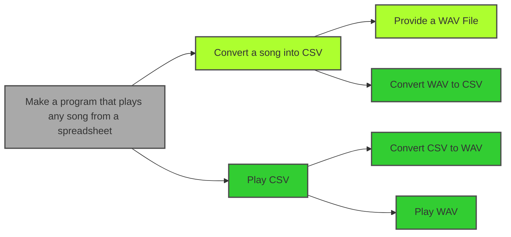

```mermaid
graph LR
    style A fill:#A9A9A9,stroke:#4d4d4d,stroke-width:2px,rounded:10px
    style B fill:#ADFF2F,stroke:#4d4d4d,stroke-width:2px,rounded:10px
    style C fill:#32CD32,stroke:#4d4d4d,stroke-width:2px,rounded:10px
    style D fill:#ADFF2F,stroke:#4d4d4d,stroke-width:2px,rounded:10px
    style E fill:#32CD32,stroke:#4d4d4d,stroke-width:2px,rounded:10px
    style F fill:#32CD32,stroke:#4d4d4d,stroke-width:2px,rounded:10px
    style G fill:#32CD32,stroke:#4d4d4d,stroke-width:2px,rounded:10px
    A[Make a program that plays any song from a spreadsheet]
    B[Convert a song into CSV]
    C[Play CSV]
    D[Provide a WAV File]
    E[Convert WAV to CSV]
    F[Convert CSV to WAV]
    G[Play WAV]
    A --> B
    A --> C
    B --> D
    B --> E
    C --> F
    C --> G
```