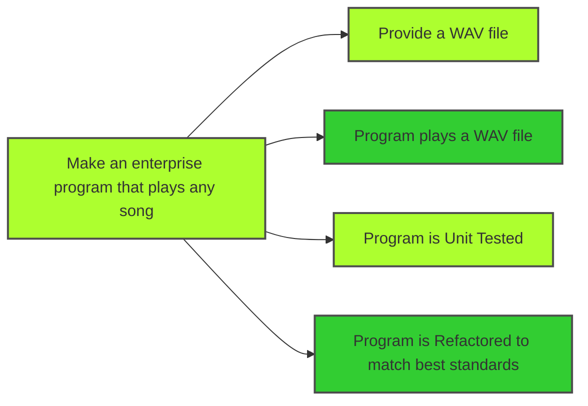

```mermaid
graph LR
    style A fill:#ADFF2F,stroke:#4d4d4d,stroke-width:2px,rounded:10px
    style B fill:#ADFF2F,stroke:#4d4d4d,stroke-width:2px,rounded:10px
    style C fill:#32CD32,stroke:#4d4d4d,stroke-width:2px,rounded:10px
    style D fill:#ADFF2F,stroke:#4d4d4d,stroke-width:2px,rounded:10px
    style E fill:#32CD32,stroke:#4d4d4d,stroke-width:2px,rounded:10px
    A[Make an enterprise program that plays any song]
    B[Provide a WAV file]
    C[Program plays a WAV file]
    D[Program is Unit Tested]
    E[Program is Refactored to match best standards]
    A --> B
    A --> C
    A --> D
    A --> E
```