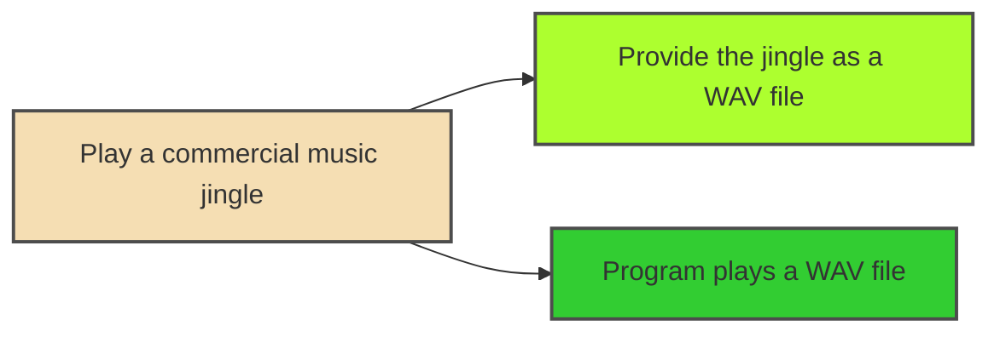

```mermaid
graph LR
    style A fill:#F5DEB3,stroke:#4d4d4d,stroke-width:2px,rounded:10px
    style B fill:#ADFF2F,stroke:#4d4d4d,stroke-width:2px,rounded:10px
    style C fill:#32CD32,stroke:#4d4d4d,stroke-width:2px,rounded:10px
    A[Play a commercial music jingle]
    B[Provide the jingle as a WAV file]
    C[Program plays a WAV file]
    A --> B
    A --> C
```